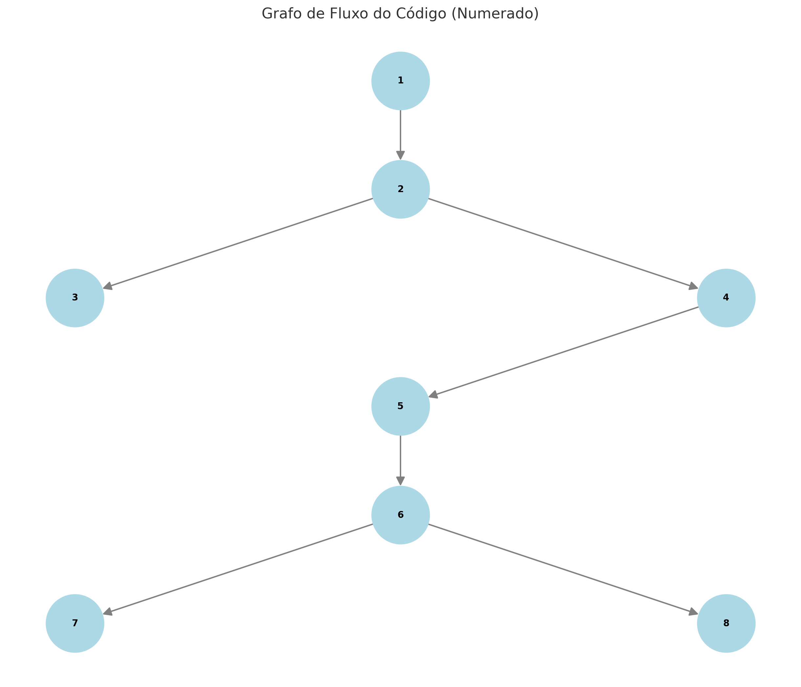

## Identificação dos Pontos (Nodos) no Código

1. **Ponto de entrada do programa** (`main`)  
2. **Chamado ao método** `verificarUsuario`  
3. **Conexão com o banco de dados** no método `conectarBD`  
4. **Construção da consulta SQL** no método `verificarUsuario`  
5. **Execução do comando SQL** (`ResultSet rs = st.executeQuery(sql)`)  
6. **Validação do resultado** (`if (rs.next())`)  
7. **Definição de `result = true` e recuperação do nome**  
8. **Saída do programa indicando sucesso ou falha**  

---

## Conexão entre os Pontos (Arestas)

- **1 → 2**: Entrada do programa chama `verificarUsuario`  
- **2 → 3**: Chamada ao método `conectarBD`  
- **2 → 4**: Construção da consulta SQL  
- **4 → 5**: Execução da consulta SQL  
- **5 → 6**: Validação do resultado da consulta  
- **6 → 7**: Se `rs.next() == true`, o usuário é válido  
- **6 → 8**: Caso contrário, o usuário ou senha são inválidos  

---

## Grafo de Fluxo do Código

---

## Complexidade Ciclomática

\(
M = E - N + 2
\)

- **E (Arestas)**: 7
- **N (Nodos)**: 8

**Resultado:** M = 1.

---

## Sequências Possíveis
1. **Caminho 1**: 1 → 2 → 3  
2. **Caminho 2**: 1 → 2 → 4 → 5 → 6 → 7  
3. **Caminho 3**: 1 → 2 → 4 → 5 → 6 → 8  

